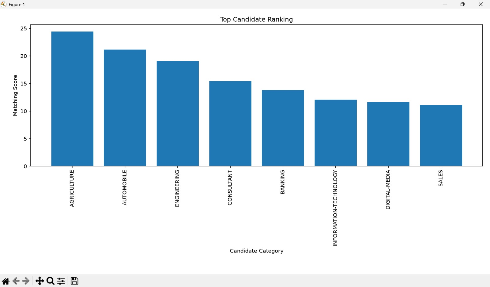
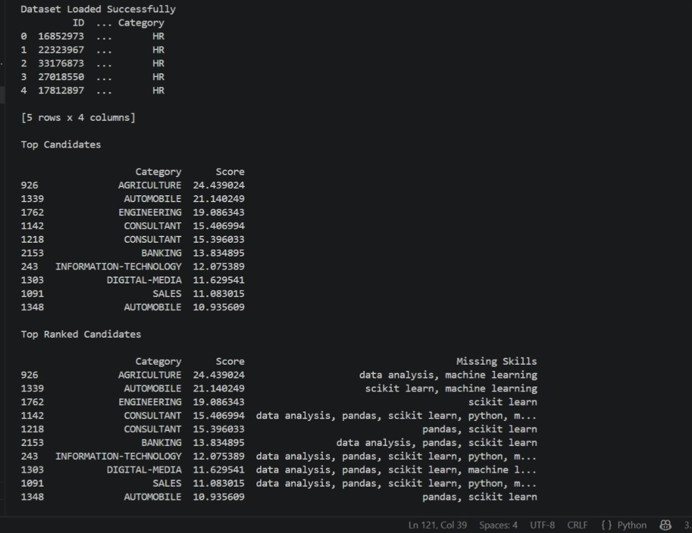

# FUTURE_ML_03

### AI Resume Screening and Candidate Ranking System
___

## 📌 Project Overview

This project is an AI-powered Resume Screening System that analyzes resumes and ranks candidates based on their similarity to a given job description. It uses Natural Language Processing (NLP) and Machine Learning techniques to automate the recruitment process.

___

🚀 Features

- Resume Parsing and Text Cleaning
- Job Description Matching
- Candidate Ranking using Cosine Similarity
- Skill Gap Identification
- Ranking Visualization using Matplotlib

___

🛠️ Technologies Used

- Python
- Pandas
- NumPy
- Scikit-Learn
- NLP (TF-IDF Vectorization)
- Matplotlib
___

📂 Dataset

Dataset Used: Resume Dataset from Kaggle

The dataset is too large to upload to GitHub directly.

Dataset Link : 

___

📊 Workflow

1. Load and preprocess resumes.
2. Clean and tokenize text data.
3. Convert text into TF-IDF vectors.
4. Calculate similarity scores with the job description.
5. Rank candidates based on scores.
6. Identify missing skills and generate results.

___

📈 Output

Graph

Ranked Candidates 

___

🎯 Conclusion

This project demonstrates how Machine Learning and NLP can be used to automate resume screening and candidate selection, making the recruitment process faster and more efficient.